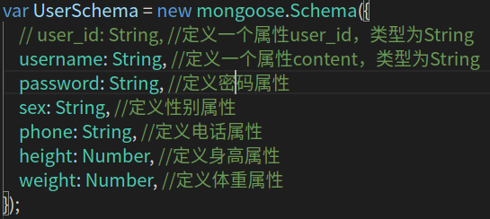
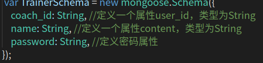
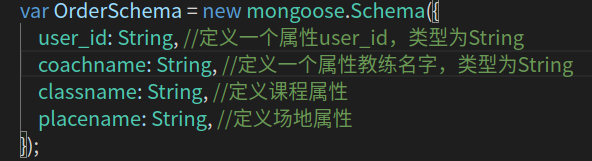
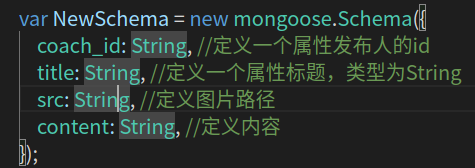
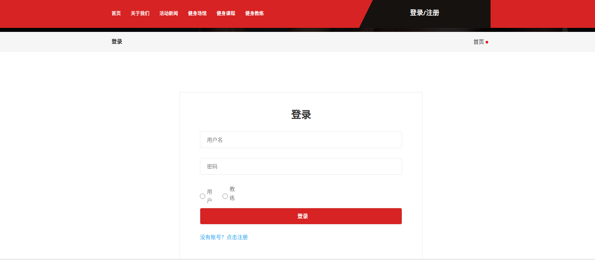
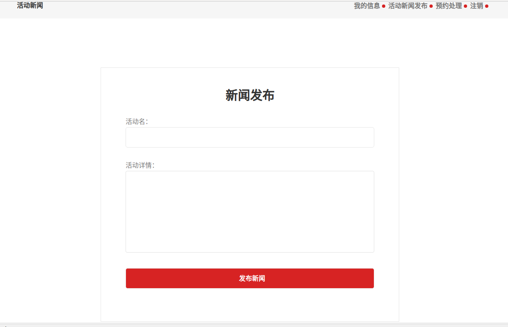

# 项目：健身管理系统

## 1.设计结构

## 2.运用内容配置

主要运用mongodb作为数据库使用mongoose,nodejs作为基本语言,express作为后端配置

## 3.使用方法

git clone https://github.com/hch86534106/nodejs-mongodb-express-project-keep.git

npm install +安装mongodb 并保持启动

npm start

然后把mongodb放在home目录，这个readme图片放不出来，要想看效果就把readme下一下吧

## 4.数据库设计

用户表

教练表

预约表

新闻表

## 5.具体页面

## 6.实现功能

#### 1.注册登录

#### 2.预约

#### 3.修改个人信息

#### 4.新闻发布

#### 5........

## 7.特色功能（感觉从这次大作业里学到了一手）

#### 1.session的妙用

没有登录只能保留在三个页面index,regist,login

#### 2.异步----用时延来解决

在大作业过程中，经常会出现函数没执行完就往下一步去了，导致数据不能及时更新，甚至没有数据，我就时延0.5s来避免了这个问题，虽然可能以后不是很实用，但是目前的数据库大小足够用了

#### 3.foreach进行两张表查询（大作业要求之一）

我有两个地方用到了两张表查询，如教练的所收到的预约，由于预约表中是没有用户名的，所以得有user_id去用户表中查询，在代码实现时我就使用了foreach和时延，另一个地方是新闻，新闻表中没有coach_name，得用coach_id去教练表中查询，原理同上。

#### 4.如何将查询的结果回到前端

`<%=user.username%>`，这是nodejs与java不同的地方

## 8.作业心得

本次作业有点赶，基本就是从零开始，尽管老师一学期教了很多，但是在大作业中还是有很多的不足需要去网上查找，如后端框架如何更好的搭建，我记得只要install某个东西，然后一句话就搞定了，还有可以随时测试的轮子，真的方便很多，看b站视频学到的https://www.bilibili.com/video/BV1N54y1C79r?p=3，在这个的基础上我找了我之前的作业，然后再修改成nodejs的代码，虽然很多功能都不完善，但是把nodejs的异步算是搞的有点头绪了

